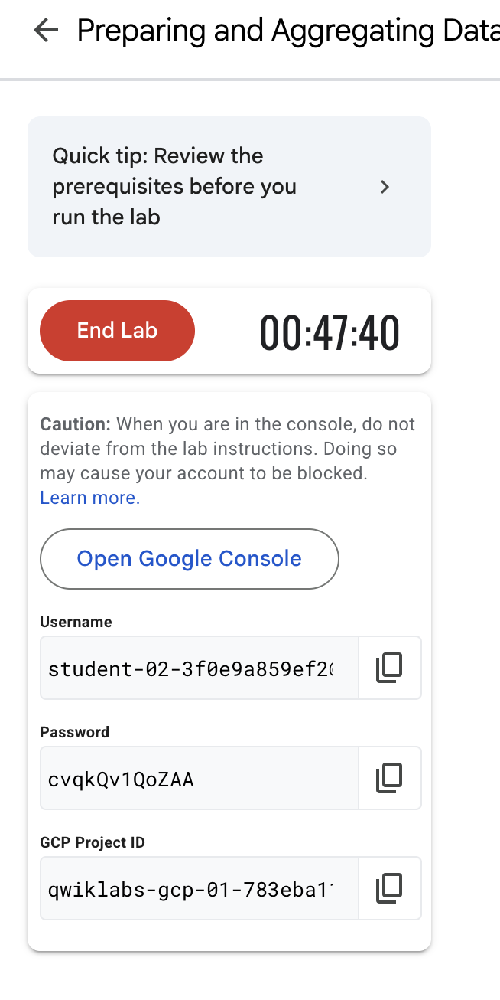

# 🕷️ paigestor

**paigestor** es una herramienta de línea de comandos (CLI) que permite scrapear páginas web en busca de archivos `.parquet`, descargarlos localmente y subirlos opcionalmente a un bucket de Google Cloud Storage (GCS).

## Requerimientos
- python 3.12 o mayor
- gcloud SDK
---

## 🛠️ Instalación

### 📦 Instalar localmente (modo desarrollo)

```bash
# Clonar repositorio
git clone https://github.com/IgnacioToledoDev/paigestor.git

# Ingresar a la raiz del proyecto
cd paigestor

# Iniciar una maquina virtual
python3 -m venv .venv

# Activar entorno virtual

# MacOS y Linux 
source .venv/bin/activate

# Windows (CMD)
.venv\Scripts\activate

# Windows (PowerShell)
.\.venv\Scripts\Activate.ps1


# Instalar dependencia necesarias
pip install -e .

# Probar
paigestor --help
```
---
## Caso de uso
A continuacion se detalla como usar este script para descargar los archivos parquet y subirlos a un google cloud storage

### Descargar archivos parquet a traves de comando
```bash
# Ejemplo
paigestor --only-scraper
```
### Resultado esperado

🕷️ Ejecutando solo el scraper...
✅ Encontrados 113 archivos parquet desde 2022 hasta hoy.
💾 Descargando archivos localmente...

📥 Descargando: https://d37ci6vzurychx.cloudfront.net/trip-data/yellow_tripdata_2025-01.parquet
yellow_tripdata_2025-01.parquet: 100%|█████| 56.4M/56.4M [00:02<00:00, 23.0MB/s]

- Al descargar todos los archivos parquet encontrados se debe haber creado una carpeta temporal con todos los parquet en la raiz de este proyecto 
```bash 
paigestor/
├── downloads/ # 📥 Carpeta temporal con todos los archivos .parquet descargados
│ ├── fhvhv_tripdata_2022-01.parquet
│ ├── fhvhv_tripdata_2022-02.parquet
│ └── ...
├── paigestor/ # Código fuente principal
│ ├── init.py
│ ├── cli.py
│ ├── orchestrator.py
│ ├── gcs_uploader.py
│ ├── scrapper.py
│ └── interfaces/
│ ├── init.py
│ ├── scrapper_interface.py
│ └── uploader_interface.py
├── .venv/
├── requirements.txt
└── README.md
```
## Subir archivos a un cloud storage
Para esta prueba se usa el laboratorio "Preparing and Aggregating Data for Visualizations using Cloud Dataprep" o tambien lo podemos buscar usando gsp823.

## Paso 1
Iniciar el laboratorio con este paso obtenemos las credenciales necesarias para logearnos en google cloud
### Credenciales


## Paso 2
Iniciar sesion para subir archivos parquet en cloud storage
```bash
# Iniciar sesion en google
gcloud auth application-default login
```

Aqui nos rediriga a una pagina y selecionaremos la opcion **Usar otra cuenta**
e ingresamos el correo que es username y su contraseña ambas visibles en la imagen de credenciales

### Seteamos el project id de donde se encuentra el proyecto
- El project id se encuentra debajo del apartado password (ver imagen de credenciales) **GCP Project ID**
```bash
gcloud config set project <project_id>
```

## Paso 3
Crear cloud storage de manera normal. En el Choose how to control access to objects
se debe quitar el check en **Choose how to control access to objects**

- Importante: Recordar nombre del bucket


## Paso 4 
Subir los archivos del bucket
```bash
#comando utilizado
paigestor --bucket '<nombre_del_bucket>'
```

- Se deberia omitir la descarga de los archivos y deberia empezar la subida de los archivos
## Resultado esperado


## Revisar si se subieron y listos


